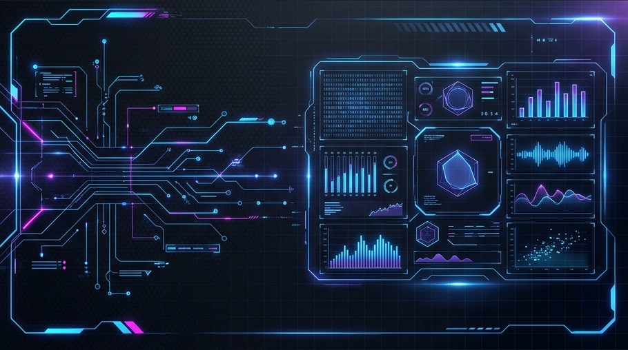

<div align="center">
  
</div>

<h1 align="center">🛡️ AG-Portfolio</h1>

<div align="center">

[](https://reactjs.org/)
[](https://vitejs.dev/)
[](https://www.framer.com/motion/)
[](https://www.ajaygangwar945.xyz)
[](https://ajaygangwar-portfolio.vercel.app/)
---

Welcome to the **AG-Portfolio**, a state-of-the-art web application that pushes the boundaries of traditional portfolio design. Built with **React 19** and **Vite**, this project features a unique high-tech interface, a fully functional **Terminal Mode**, and an **AI-powered Chatbot** driven by Google Gemini.

</div>

---

## 🌐 Live Access & Deployment

The project is fully deployed and accessible online. Experience the full interface directly in your browser:

* **🌍 Main Domain (AWS Amplify)**: [](https://www.ajaygangwar945.xyz)  
    *Infrastructure: Secured with AWS Route53, CloudFront, and SSL.*

* **🚀 Mirror Site (Vercel)**: [](https://ajaygangwar-portfolio.vercel.app/)  
    *Infrastructure: Globally distributed Vercel Edge Network.*

---

## ⚡ Key Highlights

### 🖥️ Terminal Mode Portfolio

Switch from the standard visual view to a **fully interactive CLI Terminal**. Explore the developer's journey, skills, and projects by typing commands just like a real terminal emulator.

### 🤖 AI Gemini Chatbot

Integrated with the **Google Generative AI SDK**, my portfolio features a smart assistant that can answer questions about my skills, projects, and professional background in real-time.

### 🎨 Modern & High-Tech Aesthetic

A custom-built design system using **Vanilla CSS** (zero bloat) with high-tech glassmorphism, neon accents, and responsive layout optimizations for every device.

---

## 🛠️ Tech Stack & Infrastructure

| Layer | Tools |
| :--- | :--- |
| **Frontend** | React 19, Hooks, Context API |
| **Animations** | Framer Motion (Scroll, Exit/Entry, Layout) |
| **AI Integration** | Google Generative AI (Gemini Pro) |
| **Icons** | Lucide React |
| **Styling** | Vanilla CSS3 (Custom Variables, Theme Engine) |
| **Build Tool** | Vite 6.0+ |
| **Deployment** | AWS Amplify (Primary), Vercel (Backup) |

---

## 🏗️ Getting Started

To run this project locally, follow these steps:

1. **Clone the repository:**

   ```bash
   git clone https://github.com/ajaygangwar945/AG-Portfolio.git
   cd AG-Portfolio
   ```

2. **Install dependencies:**

   ```bash
   npm install
   ```

3. **Set up Environment Variables:**
   Create a `.env` file in the root directory and add your Gemini API Key:

   ```env
   VITE_GEMINI_API_KEY=your_api_key_here
   ```

4. **Run the development server:**

   ```bash
   npm run dev
   ```

---

## 📂 Project Structure

```text
AG-Portfolio /
|
|- index.html           # Main HTML entry point
|- package.json         # Project dependencies & scripts
|- vite.config.js       # Vite build configuration
|- Project_Documentation.txt # Detailed build logic & rationale
|- .env.example         # Template for environment variables
|- .gitignore           # Git ignore file
|- amplify.yml          # AWS Amplify deployment configuration
|- README.md            # Project documentation hub
|
|- public /             # Static assets
|  |- favicon.svg       # Website favicon
|  |- icons.svg         # Icon sprite
|  |- profile_plain.png # Main profile image
|  |- resume.pdf        # Professional resume
|  L- images /          # UI generated assets
|     L- banner.png     # Professional theme banner
|
L- src /                # Application source code
   |- App.jsx           # Main application logic & routing
   |- index.css         # Global styles & design system
   |- main.jsx          # React root entry
   |- data /            # Project content & metadata
   │  L- projectsData.js 
   |- components /      # Modular UI components
   │  |- common /       # Shared stylized elements
   │  |- Hero.jsx       # High-tech intro section
   │  |- Terminal.jsx   # Interactive CLI emulator
   │  |- Chatbot.jsx    # Google Gemini AI assistant
   │  L- ...            # Other section components
   L- assets /          # Project-wide images & certifications
      L- certificates / # Formal certification photos
```

---

## 🎯 Optimization & User Experience

* **Fully Responsive**: Seamlessly scales from 4K monitors to mobile devices.
* **Dynamic Themes**: Interactive Dark/Light mode engine.
* **Micro-Animations**: Subtle UI feedback for an immersive experience.
* **SEO Optimized**: Semantic HTML and performance metrics optimized for search engines.

---

<div align="center">
  <p>Created with ❤️ by <a href="https://github.com/ajaygangwar945">ajaygangwar945</a></p>
  <p>
    <a href="mailto:ajaygangwar945@gmail.com"></a>
    <a href="https://linkedin.com/in/ajaygangwar945"></a>
  </p>
</div>
